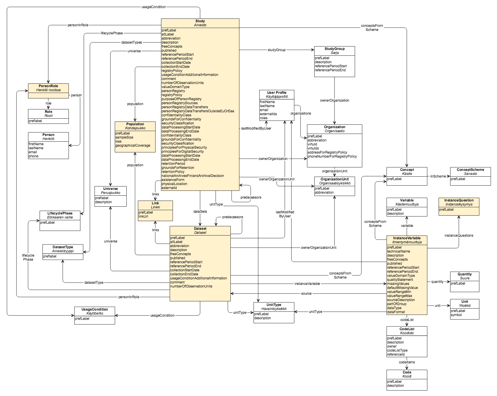

Digitaalisten tietoaineistojen kansallinen kuvausjärjestelmä: Fyysinen tietomalli
=================================================================================================================

Tätä karkeamman tason kuvaus on [käsitemalli](dtkk_kasitemalli.md).

