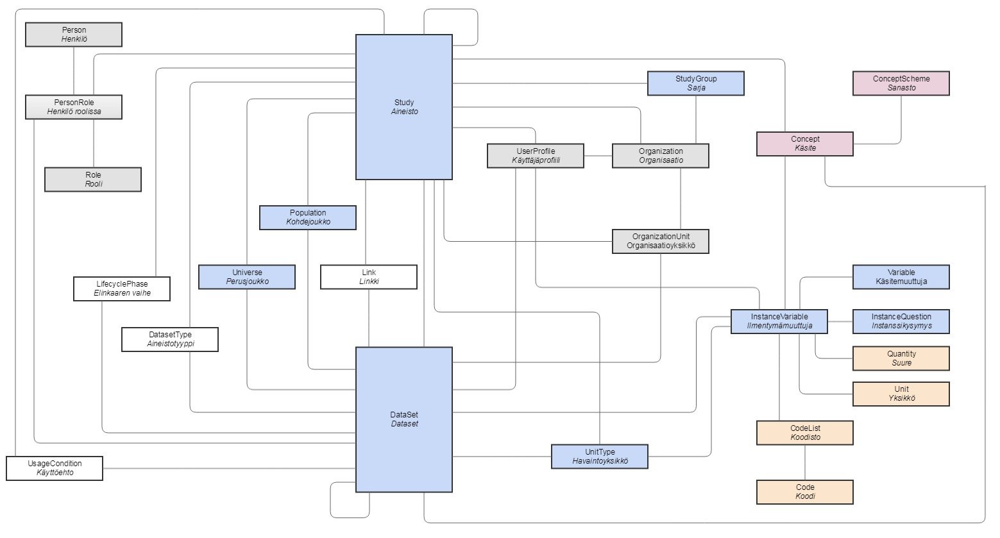
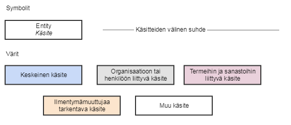
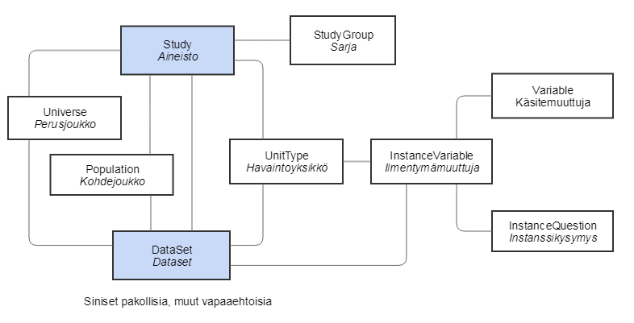

Digitaalisten tietoaineistojen kansallinen kuvausjärjestelmä: Käsitemalli
=========================================================================================================

Tätä tarkemman tason kuvaus on [fyysinen
tietomalli](dtkk_fyysinen_tietomalli.md).

Käsitemalli, kaikki käsitteet
-----------------------------

### Selitteet

Käsitemalli, tärkeimmät käsitteet
---------------------------------

